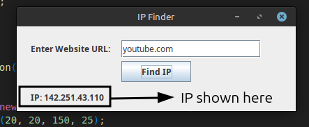

# IP Finder 🌐

**IP Finder** is a simple Java Swing application that allows you to find the IP address of any website or domain name. Just enter the website URL and click "Find IP" — the application will display the corresponding IP address.



---

## Features

* Lightweight and easy-to-use interface
* Enter any valid domain (e.g., `google.com`)
* Displays the resolved IP address
* Handles invalid or unreachable domains gracefully

---

## How to Use

### Run from Terminal or Command Prompt:

1. Compile the program:

   ```
   javac IPFinder.java
   ```

2. Run the application:

   ```
   java IPFinder
   ```

### Inside the App:

* Type a website address in the input field (e.g., `youtube.com`)
* Click the **Find IP** button
* The corresponding IP address will appear below

---

## Author

**Prince**
Expert Academy - Java Project 2025

---

## License

This project is free to use, modify, and distribute.
